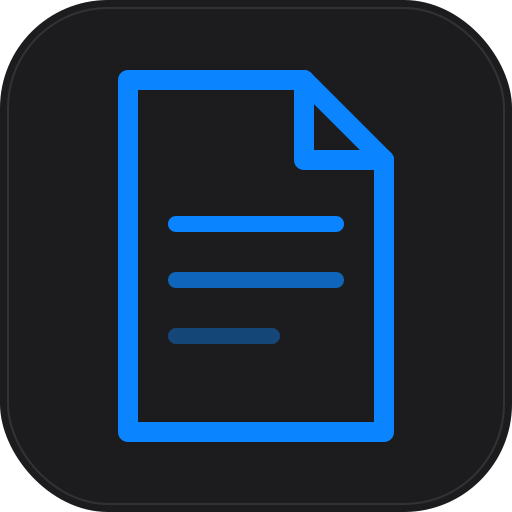

# 📓 Ragnar Notes

<p align="center">
  
</p>

<p align="center">
  <strong>A sleek, local-first Markdown note-taking app for macOS.</strong>
  <br/>
  Built with Tauri + React. No cloud. No sync. Your notes, your machine.
</p>

<p align="center">
  
  
  
  
  
</p>

---

## 📦 Installation (macOS)

### Option A: Download the Release

1. Go to [**Releases**](https://github.com/VidhyadharanSS/RagnarNotes/releases)
2. Download `Ragnar.Notes.dmg` (macOS Apple Silicon / Intel)
3. Open the `.dmg` file
4. Drag **Ragnar Notes** into your `/Applications` folder
5. Open from Applications — if macOS shows a security warning:
   - Go to **System Settings → Privacy & Security**
   - Click **"Open Anyway"** next to the Ragnar Notes warning
6. Done! 🎉

### Option B: Build from Source

**Prerequisites:**
- **macOS** 12+ (Monterey or later)
- **Node.js** ≥ 18 — [Download](https://nodejs.org)
- **Rust** — Install via `curl --proto '=https' --tlsv1.2 -sSf https://sh.rustup.rs | sh`
- **Xcode Command Line Tools** — `xcode-select --install`

**Steps:**

```bash
# 1. Clone the repository
git clone https://github.com/VidhyadharanSS/RagnarNotes.git
cd RagnarNotes

# 2. Install dependencies
npm install

# 3. Build the macOS app (.dmg + .app)
npm run tauri build

# 4. The built app will be at:
#    src-tauri/target/release/bundle/dmg/Ragnar Notes_1.0.0_aarch64.dmg
#    src-tauri/target/release/bundle/macos/Ragnar Notes.app
```

### Option C: Development Mode (Web Preview)

```bash
git clone https://github.com/VidhyadharanSS/RagnarNotes.git
cd RagnarNotes
npm install
npm run dev        # → http://localhost:1420
```

### Option D: Development Mode (Tauri Window)

```bash
npm run tauri dev  # Spawns native macOS window with hot-reload
```

---

## ✨ Features

| Category | Feature | Description |
|----------|---------|-------------|
| **Editor** | Markdown editing | Full GFM support — tables, task lists, code blocks |
| **Editor** | Syntax highlighting | 150+ languages via highlight.js |
| **Editor** | Split view | Edit + Preview side-by-side (`⌘⇧S`) |
| **Editor** | Zen mode | Distraction-free writing (`⌘.`) |
| **Editor** | Smart Enter | Auto-continues lists, tasks, blockquotes |
| **Editor** | Wiki-links | `[[Note Title]]` — click to navigate |
| **Editor** | Callout blocks | `> [!NOTE]`, `> [!WARNING]`, `> [!TIP]` |
| **Notes** | Pin notes | Float pinned notes to top |
| **Notes** | Tags & filter | Filter by tag chips in note list |
| **Notes** | Trash & restore | Soft-delete with undo; Empty Trash |
| **Notes** | **Bulk select** | Multi-select for bulk trash/delete/export |
| **Notes** | **Import .md files** | Drop or browse to import Markdown files |
| **Notes** | Duplicate | One-click copy any note |
| **Export** | PDF export | Theme-aware — matches dark/light mode |
| **Export** | Markdown export | Raw `.md` download |
| **Export** | HTML export | Standalone web page with embedded styles |
| **Export** | **Bulk export** | Select multiple notes → export all |
| **Storage** | **Local persistence** | All notes saved to localStorage — survives reload |
| **Storage** | **Storage manager** | View usage, import/export, clear data |
| **UI** | Dark / Light / Auto | Full theme support with instant switching |
| **UI** | Command palette | `⌘K` — search notes, run commands |
| **UI** | Note info panel | Outline, backlinks, metadata, history |
| **UI** | Word goal | Set daily writing goals with progress ring |
| **UI** | Reading progress | Scroll progress bar in preview mode |
| **Security** | XSS prevention | HTML sanitization, script removal |
| **Testing** | 132 unit tests | Stores, utils, hooks — all covered |

---

## ⌨️ Keyboard Shortcuts

| Shortcut | Action |
|----------|--------|
| `⌘K` | Command Palette |
| `⌘N` | New Note |
| `⌘/` | Toggle Sidebar |
| `⌘.` | Zen / Focus Mode |
| `⌘E` | Edit Mode |
| `⌘⇧P` | Preview Mode |
| `⌘⇧S` | Split View |
| `⌘⇧E` | Export Note |
| `⌘B` | **Bold** |
| `⌘I` | *Italic* |
| `` ⌘` `` | `Inline Code` |
| `⌘⇧X` | ~~Strikethrough~~ |
| `↑↓` | Navigate notes |
| `Enter` | Open selected note |
| `Esc` | Close any overlay |

---

## 🏗️ Architecture

```
ragnar-notes/
├── src/                          # React frontend
│   ├── components/
│   │   ├── editor/               # Editor, toolbar, preview, status bar
│   │   ├── features/             # Command palette, export, settings, storage
│   │   ├── layout/               # Sidebar, note list, editor pane, title bar
│   │   ├── onboarding/           # Vault picker (first launch)
│   │   └── ui/                   # Toast, tooltip, context menu, theme toggle
│   ├── hooks/                    # Custom React hooks
│   ├── stores/                   # Zustand state management (persisted)
│   ├── utils/                    # Format, sanitize, keyboard, markdown, export
│   ├── lib/                      # Tauri bridge, seed data
│   ├── styles/                   # Global CSS, syntax highlighting
│   ├── types/                    # TypeScript type definitions
│   └── __tests__/                # Vitest test suite (132 tests)
├── src-tauri/                    # Rust backend (Tauri)
│   ├── src/
│   │   ├── main.rs               # Entry point
│   │   ├── commands/             # File system + app commands
│   │   ├── models.rs             # Data models
│   │   └── error.rs              # Error types
│   ├── Cargo.toml                # Rust dependencies
│   └── tauri.conf.json           # Tauri configuration
├── package.json                  # v1.0.0
├── vitest.config.ts              # Test configuration
└── tailwind.config.ts            # Tailwind + custom theme
```

---

## 🧪 Running Tests

```bash
# Run all 132 tests
npm test

# Watch mode
npm run test:watch

# With coverage report
npm run test:coverage
```

**Test coverage:**
- `src/utils/` — format, sanitize, keyboard, markdown, cn (89 tests)
- `src/stores/` — appStore, editorStore, notesStore, searchStore (43 tests)

---

## 🛠️ Tech Stack

| Layer | Technology |
|-------|-----------|
| Desktop | Tauri 1.x (Rust) |
| Frontend | React 18 + TypeScript 5 |
| Styling | Tailwind CSS 3 + CSS custom properties |
| Animations | Framer Motion 11 |
| State | Zustand 4 (devtools + persist) |
| Markdown | `marked` (GFM) + custom renderer |
| Syntax | `highlight.js` (150+ languages) |
| PDF | `html2pdf.js` |
| Testing | Vitest + Testing Library |
| Build | Vite 5 |

---

## 📄 License

MIT © 2024 [VidhyadharanSS](https://github.com/VidhyadharanSS)
